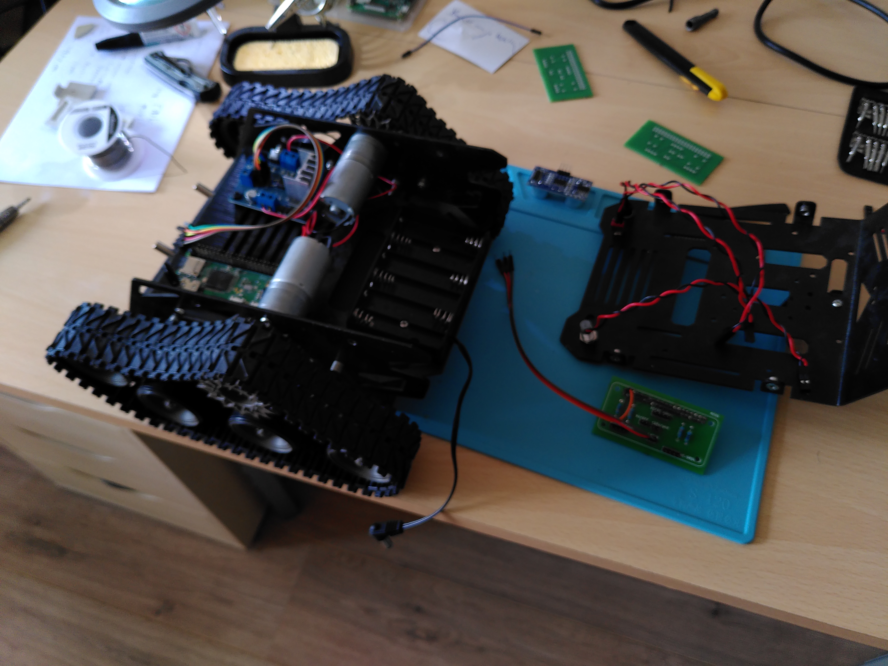

#Index

##Design documents
**Fixation_articulée_pour_HC-SR04.zip**  
Thingiverse file for 3d printing custom part

**tank.fzz**  
This file contains the breadboard schema drawing fot my tank project.
.fzz is a fritzing file. You can download fritzing from https://fritzing.org/.

**tank_bb.png**
This file shows the breadboard of tank.fzz, so you can see the breadboard design without fritzing.

**tank_pcb.fzz**  
This file contains an altered version from tank.fzz, where I optimized it for my PCB. Some components are missing here as they are to be connected using jumper wires.

##progress photos
**custom head.jpg**  
This is the PCB I had made on which to connect all components.  
Left you see one without the components, right with the components soldered on.
The LED I used for the distance blinking. It connects to the bottom-left connector together with the stop button.

**Disassembled_1.jpg**  
Disassembled tank. You see the chassis, the top of the robot, and the head with some connectors to it.

**Disassembled_added_custom head.jpg**  
At the bottom-left you see the PI-nano I used.  
On the top left the motor head which controls the motors you see top and bottom middle.  
At the right you see the battery pack to power the robot.

**Disassembled_pi_nano.jpg**  
In this picture you see I added the head on the pi-nano.  
The motor head is connected to the GPIO ports.  
The red, orange and brown wires are not connected yet, but they are powering the head (12v, 5v, and ground)

